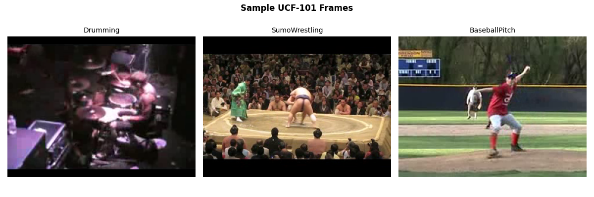
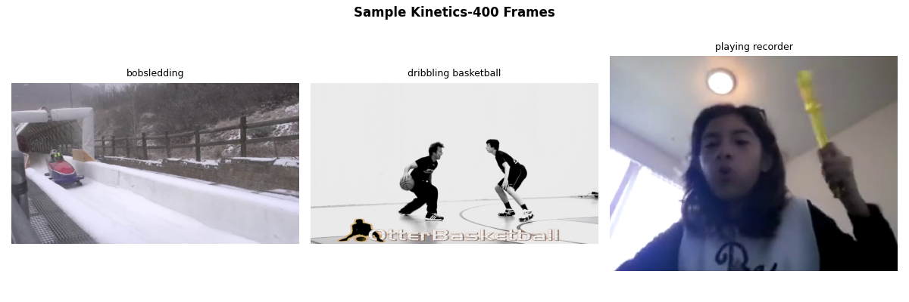
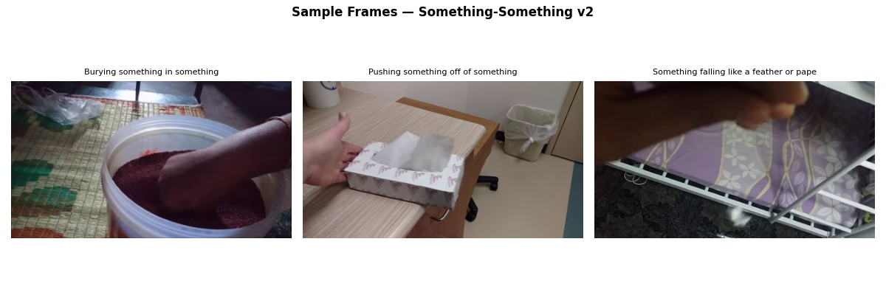
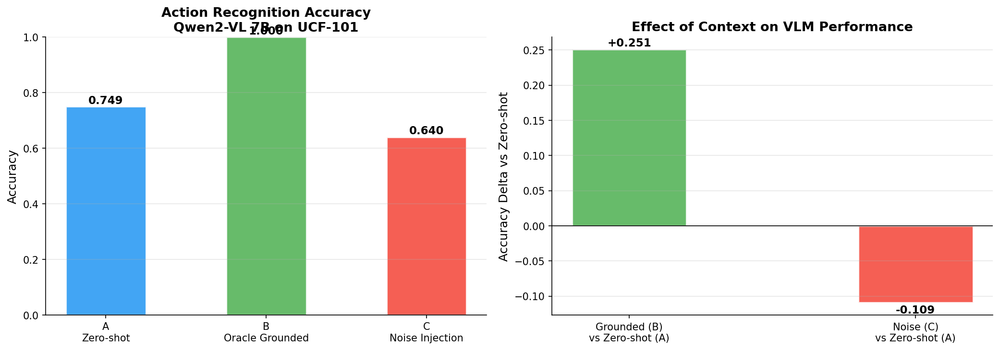
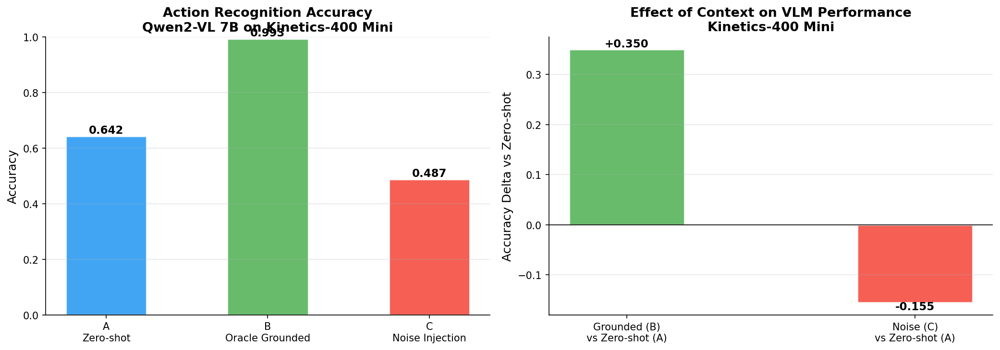
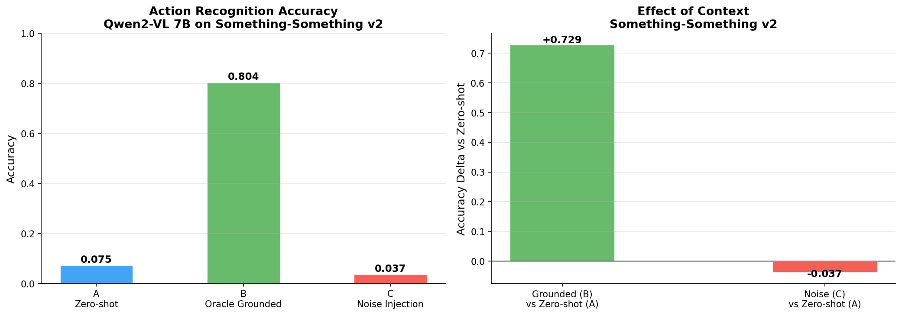
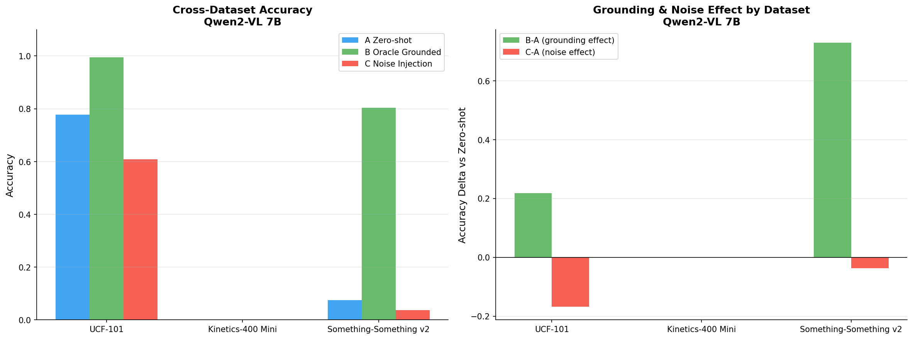

# Do VLMs Actually Use Text Context or Just the Image?

A controlled experiment evaluating whether vision-language models genuinely use text context for action recognition, or rely purely on visual features.

Tested on **three datasets** of increasing difficulty using **Qwen2-VL 7B**.

---

## The Question

When a label or description is passed alongside an image to a VLM, does the model actually use it, or does it just look at the image and ignore the text?

This matters practically: in multimodal pipelines where action labels, class names, or descriptions are passed as context, the question is whether that context has any measurable effect on model behaviour.

---

## Experimental Design

Three conditions, same image each time, only the prompt changes:

| Condition | Input | Purpose |
|-----------|-------|---------|
| **A — Zero-shot** | Frame only | Baseline: raw visual understanding |
| **B — Oracle Grounded** | Frame + correct label | Upper bound: does accurate context help? |
| **C — Noise Injection** | Frame + wrong label | Control: does the model genuinely use context? |

Condition C is the key design decision. If wrong context degrades accuracy below zero-shot, the model is genuinely reading and using the text, not ignoring it.

**Model:** Qwen2-VL 7B  
**Frame selection:** Single middle frame extracted from each video  
**Significance testing:** McNemar test on paired binary outcomes

---

## Prompts

The same three prompts are used across all datasets. Only the class list changes depending on the dataset (101 classes for UCF-101, 200 for Kinetics-400, 174 for SSv2).

**Condition A — Zero shot**
```
You are an action recognition system.
Possible action classes: {all class names listed here}.
What action is being performed in this image?
Return only the single class name from the list above. No explanation.
```

**Condition B — Oracle Grounded**
```
A reference system identified the action as: {correct label}.
Using this context and the image, select the correct action from: {all class names listed here}.
Return only the single class name. No explanation.
```

**Condition C — Noise Injection**
```
A reference system identified the action as: {randomly sampled wrong label}.
Using this context and the image, select the correct action from: {all class names listed here}.
Return only the single class name. No explanation.
```

Note: all class names are provided in the prompt for every condition including zero shot. This is closed set evaluation, not open vocabulary. 

---

## Datasets

All datasets are publicly available on Kaggle. Add them to your notebook via the Input panel before running.

| Dataset | Classes | Format | Difficulty | Samples | Kaggle |
|---------|---------|--------|------------|---------|--------|
| UCF-101 | 101 | .avi | Low — scene-based actions | 303 | [matthewjansen/ucf101-action-recognition](https://www.kaggle.com/datasets/matthewjansen/ucf101-action-recognition) |
| Kinetics-400 Mini | 200 | .mp4 | Medium — diverse YouTube clips | 400 | [duckdai/kinetics400-mini](https://www.kaggle.com/datasets/duckdai/kinetics400-mini) |
| Something-Something v2 | 174 | .webm | High — requires temporal reasoning | 348 | [ipythonx/ssv2test](https://www.kaggle.com/datasets/ipythonx/ssv2test) |

---

## Sample Frames

**UCF-101**



**Kinetics-400 Mini**



**Something-Something v2**



---

## Results

| Dataset | A Zero-shot | B Oracle | C Noise | B-A delta | C-A delta |
|---------|------------|---------|---------|-----------|-----------|
| UCF-101 | 0.749 | 1.000 | 0.640 | **+0.251** | -0.109 |
| Kinetics-400 Mini | 0.642 | 0.993 | 0.487 | **+0.350** | -0.155 |
| Something-Something v2 | 0.075 | 0.804 | 0.037 | **+0.729** | -0.037 |

All differences statistically significant (McNemar test, p < 0.0001 across all datasets and condition pairs).

### UCF-101



### Kinetics-400 Mini



### Something-Something v2



### Cross-Dataset Comparison



---

### Key Findings

**Finding 1: VLMs genuinely use text context.**  
Oracle grounding improves accuracy significantly on all three datasets. The model is not ignoring the prompt.

**Finding 2: Wrong context actively hurts performance.**  
Noise injection degrades accuracy below zero shot on all three datasets. The model reads the label and is misled by incorrect ones.

**Finding 3: The grounding effect scales with dataset difficulty.**  
As zero-shot accuracy drops (harder dataset), the B-A improvement grows larger. The model relies on context more when visual information is ambiguous.

| Dataset | Zero-shot | Grounding improvement |
|---------|-----------|----------------------|
| UCF-101 | 74.9% | +25.1% |
| Kinetics-400 Mini | 64.2% | +35.0% |
| Something-Something v2 | 7.5% | +72.9% |

**Note on Something-Something v2:** This dataset is explicitly designed to require temporal reasoning. Actions like "moving something up" vs "moving something down" are visually identical from a single frame. The 7.5% zero shot reflects the single frame limitation, not model capability. Oracle accuracy of 80.4% shows the model understands these actions correctly when given context. A multi frame extension is planned.


---

## Notebooks

| Notebook | Dataset | Description | Kaggle |
|----------|---------|-------------|--------|
| `notebooks/ucf101_eval.ipynb` | UCF-101 | Evaluates Qwen2-VL 7B on 303 samples across 101 scene-based action classes. Includes per-class analysis showing which actions benefit most from grounding. | [Open in Kaggle](https://www.kaggle.com/code/muneebabajwa/ucf101-eval) |
| `notebooks/kinetics400_eval.ipynb` | Kinetics-400 Mini | Replication on 400 samples across 200 YouTube action classes. Includes cross-dataset comparison chart against UCF-101 results. | [Open in Kaggle](https://www.kaggle.com/code/muneebabajwa/kinetics400-eval) |
| `notebooks/multi_dataset_eval.ipynb` | SSv2 + config switcher | Unified notebook supporting all three datasets via a single config variable. Change one line to switch between UCF-101, Kinetics-400, and SSv2. Includes full cross-dataset comparison in the final cell. | [Open in Kaggle](https://www.kaggle.com/code/muneebabajwa/multi-dataset-eval) |


**To run on Kaggle:**
1. Open the notebook link above
2. Click Edit to open the editor
3. Add the dataset via the Input panel on the right sidebar
4. Enable GPU T4 and Internet in session settings
5. Run All

**To run locally:**
```bash
pip install -r requirements.txt
```
Note: Qwen2-VL 7B requires approximately 16GB VRAM. Local runs were not tested — Kaggle free tier is the recommended environment.

---

## Repository Structure

```
vlm-action-grounding/
├── README.md
├── requirements.txt
├── notebooks/
│   ├── ucf101_eval.ipynb
│   ├── kinetics400_eval.ipynb
│   └── multi_dataset_eval.ipynb
└── results/
    ├── ucf101_results.csv
    ├── kinetics400_results.csv
    ├── ssv2_results.csv
    └── figures/
        ├── ucf101_sample_frames.png
        ├── kinetics400_sample_frames.png
        ├── ssv2_sample_frames.png
        ├── ucf101_results.png
        ├── kinetics400_results.png
        ├── ssv2_results.png
        └── cross_dataset_comparison.png
```

---

## Limitations

- **Single frame per video:** middle frame only. Multi frame evaluation is a planned extension, particularly for SSv2.
- **Substring match scoring:** hit scoring uses case insensitive substring match, not semantic similarity. May underestimate zero shot accuracy when the model paraphrases correctly.
- **2 samples per class:** per class results should be interpreted cautiously at this sample size.
- **Closed set evaluation:** all class names are provided in the prompt for all conditions including zero shot. This is not open vocabulary evaluation.

---

## Possible Extensions

- [ ] Multi frame condition for SSv2 (4 evenly spaced frames)
- [ ] Semantic similarity scoring using sentence transformers
- [ ] Second model comparison (LLaVA or InternVL)
- [ ] Pixtral 12B substitution when VRAM available

---

## Author

**Muneeba Nasir** — ML Engineer at CNRS I3S, Sophia Antipolis  
[LinkedIn](https://www.linkedin.com/in/muneeba-nasir-5412bb166/) · [Kaggle](https://www.kaggle.com/muneebabajwa)
